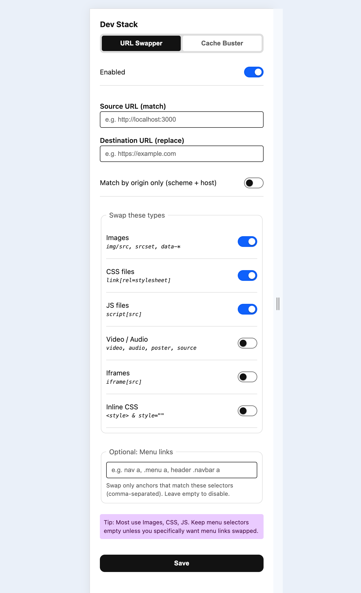

# Dev Stack

A Chrome extension for developers with multiple tools to enhance your development workflow.

## Features

### 🔄 URL Swapper

Replace URLs on web pages to test with different environments:

- Swap source URLs with destination URLs
- Support for images, CSS, JS, media files, iframes, and inline CSS
- Optional menu link swapping with CSS selectors
- Origin-only matching mode (matches only scheme + host, ignoring paths)
- Real-time processing of dynamically added content




### 🧹 Cache Buster

Force reload of CSS/JS files without server changes:

- Add `?ver=timestamp` query parameters to CSS and/or JS files
- Individual controls for CSS vs JS files
- File-specific filtering using patterns (e.g., `style.css`, `main*.css`, `components/*.css`)
- Disable browser cache for selected domains via fetch/XMLHttpRequest override
- Target specific domains or apply globally
- Works with dynamically loaded content and preload links
- Processes both regular links and preload resources


## Installation

1. Clone or download this repository
2. Open Chrome and go to `chrome://extensions/`
3. Enable "Developer mode"
4. Click "Load unpacked" and select the DevStack folder
5. The extension icon will appear in your toolbar


## Usage

Click the Dev Stack icon to open the popup with two tabs:

### URL Swapper Tab

1. Toggle "Enabled" to activate URL swapping
2. Enter your source URL (e.g., `http://localhost:3000`)
3. Enter your destination URL (e.g., `https://example.com`)
4. Toggle "Match by origin only" if you want to match only scheme + host (ignoring paths)
5. Choose which types of assets to swap (images, CSS, JS, media, iframes, inline CSS)
6. Optionally add CSS selectors for menu links (comma-separated)
7. Click "Save"

### Cache Buster Tab

1. Toggle "Enabled" to activate cache busting
2. Enable "Add ?ver=timestamp to CSS files" and/or "Add ?ver=timestamp to JS files"
3. Optionally specify file patterns for CSS/JS files (one per line, supports wildcards like `*.css` or `main*.js`)
4. Enable "Disable browser cache for selected domains" to prevent all caching via request headers
5. Enter target domains (one per line) or leave empty for all domains
6. Click "Save"

## Development

The extension consists of:

- `popup.html` - Main UI with tabbed interface
- `popup.js` - Tab management and settings persistence
- `content.js` - URL Swapper functionality with mutation observer
- `cache-buster.js` - Cache busting functionality with file filtering
- `style.scss` - Compiled styles for the popup interface
- `chrome-mock.js` - Chrome API mock for development
- `manifest.json` - Extension configuration

For local development without loading the extension, include the Chrome API mock:

```html
<script src="chrome-mock.js"></script>
```

This provides mock implementations of Chrome extension APIs for testing the popup interface.

## License

MIT
